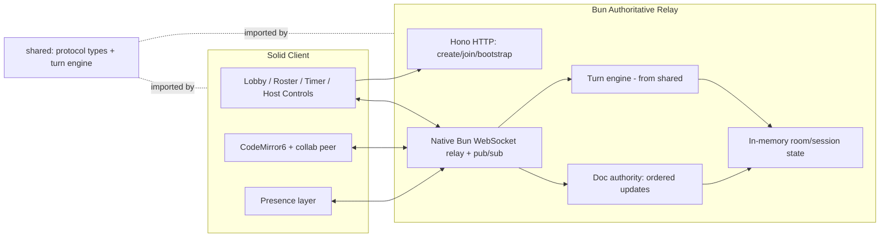

# FEAT-001 — Turn-Based Code Relay (Foundation Slice) — Design

**Status:** Approved
**Source requirements:** [`requirements.md`](./requirements.md)

## 1. Problem Statement

Build the collaboration + turn-based relay backbone with a minimal shared
editor: an ephemeral, room-based, real-time multiplayer session where exactly
one **Driver** holds an **edit token** during a time-bound **turn**, an
**authoritative relay** orders edits and guarantees convergence, presence is
broadcast live, roles are enforced server-side, driver selection is round-robin
or manual, and driver/host/observer disconnects are handled safely. No
persistence, no execution, no autocomplete.

## 2. Requirements Coverage

| Group | Requirements |
|-------|--------------|
| Session/room lifecycle & ephemeral identity | REQ-001..004 |
| Roles & authorization | REQ-005, REQ-006 |
| Turn engine | REQ-007..011 |
| Edit token & control | REQ-012..015 |
| Real-time sync & presence | REQ-016..018 |
| Minimal editor | REQ-019 |
| Edge cases & failure modes | REQ-020..025 |
| Non-functional | NFR-001..006 |

## 3. Approved Technology Decisions

- **Language:** TypeScript end-to-end.
- **Editor:** CodeMirror 6 (chosen over Monaco for customizability and
  modularity). Use `@codemirror/collab` for authoritative OT-based collaboration
  (`ChangeSet`, `rebaseUpdates`, `sendableUpdates` / `receiveUpdates`,
  `getSyncedVersion`, `sharedEffects`). This matches the requirements'
  "authoritative relay orders edits" model and avoids building a custom OT
  engine.
- **Convergence strategy:** CodeMirror `@codemirror/collab` authoritative-server
  model. Turns enforce a single writer at a time, so cross-writer conflict is
  rare by construction; collab still guarantees convergence and handles
  reconnect/rebase. `sharedEffects` provides a forward-compatible path for
  **future** per-observer markup/drafts without changing the relay.
- **Runtime & monorepo:** Bun with Bun workspaces. Native HTTP + WebSocket,
  native topic pub/sub, built-in `bun test`, native TypeScript.
- **Backend framework — hybrid:** Use **Hono for the HTTP surface** (routing,
  CORS, validation, error handling) via `Bun.serve({ fetch: app.fetch, websocket })`.
  Keep the **WebSocket path on Bun's native handler**: perform the upgrade with
  `server.upgrade(req, { data })` and handle `open` / `message` / `close` in
  Bun's native `websocket` handler so we retain Bun's native pub/sub
  (`ws.subscribe(roomId)` / `server.publish(roomId, msg)`) and the raw `Server`
  instance for efficient room broadcast (needed for NFR-001). Do **not** route
  the relay through Hono's `upgradeWebSocket` helper, because it wraps sockets in
  an adapter-agnostic interface that does not surface Bun's subscribe/publish or
  the raw `Server`.
- **Frontend:** SolidJS + Vite, using `solid-codemirror` for the CM6 primitive.
  CM6 is framework-agnostic and drives its own DOM; Solid's fine-grained
  reactivity suits the surrounding lobby/roster/timer/presence UI.
- **Styling:** Tailwind CSS v4 via the official `@tailwindcss/vite` plugin (no
  PostCSS / `tailwind.config` boilerplate). Tailwind utility classes for all
  client UI.
- **NFR-006 (transport independence):** Keep session/role/turn/token/presence
  logic transport-agnostic — the turn engine and protocol types live in
  `packages/shared` as pure logic, independent of Bun's WS, so a future LAN/P2P
  transport can be added without changing behavior. LAN/P2P is **not**
  implemented in this slice.

## 4. Architecture

Monorepo (Bun workspaces):

- **`packages/shared`** — wire protocol types (doc/presence/control messages)
  and the pure turn engine (session state machine, rotation, token invariant,
  race resolution) as framework/transport-free logic with exhaustive unit tests.
- **`packages/server`** — Bun HTTP via Hono (create/join room, document
  bootstrap) + native Bun WebSocket relay (collab authority, presence fan-out
  via native pub/sub, turn timers, disconnect grace handling). In-memory only;
  nothing persisted.
- **`packages/client`** — Solid + Vite + Tailwind v4 app: lobby (create/join),
  session view (CM6 editor, roster, turn timer, host controls), collab peer
  wiring + presence layer.

## 5. Message Model

One WebSocket per client; a **room maps to a pub/sub topic**.

- **Doc channel:** `getDocument` / `pullUpdates` / `pushUpdates` (collab
  authority). Server rejects `pushUpdates` from non-token-holders (REQ-013/014,
  server-side per NFR-005). Version mismatches are reconciled with
  `rebaseUpdates`.
- **Presence channel:** `presence` (cursor/selection), broadcast, transient,
  purged on disconnect/end (REQ-018).
- **Control channel:** session/turn events — `roleAssigned`,
  `tokenGranted` / `tokenRevoked`, `turnStarted` / `turnEnded`, `timerTick`,
  `rotationUpdated`, `driverDisconnected`, host actions
  (`reassign` / `extend` / `skip`), `sessionEnded`.

## 6. Server-Side Invariants

- **Exactly-one-token** (REQ-012): at most one edit token per session at any
  time; transfers revoke before/atomically with granting.
- **Read-only for non-drivers** (REQ-013/014): enforced at the authoritative
  relay, not solely client-side (NFR-005).
- **Single turn-end resolution** guarding the early-end vs. timer-expiry race
  (REQ-024): a turn ends exactly once and advances to exactly one next turn.
- **Fair rotation with late-comer insertion** (REQ-011/025): deterministic
  order; late joiners never jump ahead of participants who have not yet driven
  in the current cycle; recalculation never interrupts the active turn.

## 7. Task Breakdown

Each task is a working, demoable increment, built test-first where applicable,
ending by wiring into the running app. No orphaned code.

1. **Monorepo & runtime bootstrap.** Bun workspaces with `shared`, `server`
   (Hono on `Bun.serve`), `client` (Solid + Vite + Tailwind v4 via
   `@tailwindcss/vite`), shared strict TS config, `bun test` wired. A trivial
   `shared` export imported by both server and client proves cross-package
   resolution. Demo: `bun test` passes; server health check 200; client loads a
   Tailwind-styled placeholder importing from `shared`.
2. **Protocol types + pure turn-engine skeleton in `shared`.** Wire message
   types (doc/presence/control) and a pure `SessionState` reducer for
   create/config/start — no turns yet; role model (Host/Observer/Spectator,
   host-as-participant flag). Encodes REQ-005/006 role rules and REQ-007
   "no turn mode ⇒ cannot start" guard.
3. **Room lifecycle over HTTP as Hono routes.** Create room (returns room code +
   link + ephemeral host token), join by code (participant vs spectator), fetch
   bootstrap doc+version. In-memory registry; invalid/ended room denied
   (REQ-001/002/003, reject partial init REQ-001.4). CORS + validation + error
   middleware.
4. **WebSocket connect + authoritative document relay** (single writer, no turns
   yet). WS upgrade via `server.upgrade(req, { data })`; `open`/`message`/`close`
   on Bun's native handler; subscribe socket to room topic; `getDocument` /
   `pullUpdates` / `pushUpdates` collab authority in-memory; CM6
   `@codemirror/collab` peer on the client; broadcast via Bun native pub/sub
   (REQ-016/017, NFR-001). `rebaseUpdates` on version mismatch.
5. **Presence channel** (cursors/selections) on a separate channel. Broadcast
   cursor/selection as transient presence; render remote cursors/selections in
   CM6; remove on disconnect; shown to spectators too (REQ-018). Anchor via
   logical positions mapped through changes (foundation for REQ-015).
6. **Edit token & server-side read-only enforcement.** Edit token in session
   state (exactly one holder); server rejects `pushUpdates` from non-holders and
   any spectator mutation; client editor toggles read-only from token
   (REQ-012/013/014, NFR-005). Denials keep state consistent for others
   (REQ-014.3).
7. **Turn engine — start/advance, timer, early-end** (manual pass first). Start
   grants token + starts timer; end on expiry/host action; manual-pass selection
   (host assigns next driver). Broadcast `turnStarted`/`turnEnded`, `timerTick`,
   token grant/revoke (REQ-007/009/010/012.3, REQ-024). Early-end only in the
   early-end mode (REQ-010.3/4).
8. **Round-robin selection with fair late-comer recalculation.** Deterministic
   rotation over eligible participants; late Observers inserted fairly; leavers
   removed without stalling; recompute without interrupting the active turn
   (REQ-008/011/025). Host+participant included per creation choice; spectators
   excluded.
9. **Drift-free token handoff** (logical anchoring across handoff). Cursors/
   selections keep logical positions across handoffs and surrounding edits; all
   clients converge on identical content at handoff completion (REQ-015,
   verified against REQ-017). Map presence anchors through `ChangeSet`.
10. **Disconnect handling — driver grace period + host prompt + safe defaults.**
    On driver disconnect during a turn: pause timer, hold token for a grace
    period, prompt Host (reassign/extend/skip). Reconnect within grace (no host
    action) restores token + resumes timer. Grace elapse: round-robin
    auto-advances; manual pass stays paused until host acts. Handle
    host+participant driver disconnect and host-token binding retention
    (REQ-020/022).
11. **Non-driver disconnect/rejoin + reconnection resync.** Observer/Spectator
    disconnects don't interrupt the turn; presence removed; rotation skips absent
    observers. On rejoin, resync to authoritative doc+version, restore
    role/eligibility/read-only, lose no accepted edit (REQ-021/023, NFR-002).
12. **Ephemeral teardown + host authorization hardening.** End session (host
    action or terminating condition): transition to ended, revoke eligibility,
    purge doc/turn history/presence/participants/room code, reject subsequent
    joins/actions; all admin actions require host token; invalidate host token
    and ephemeral IDs on end (REQ-004/005, REQ-003.3, NFR-005.2).
13. **Editor polish — syntax highlighting set, extensibility, mobile
    responsiveness.** CM6 language support for TypeScript, JavaScript, Bash,
    PowerShell, HTML, CSS, Python, SQL, JSON, YAML, TOML via a language registry
    that adds languages without touching relay/turn engine; responsive editor
    canvas with Tailwind; no autocomplete/execution (REQ-019, NFR-003/004).
14. **End-to-end integration pass + latency/convergence validation.** Full-flow
    across two+ simulated clients: create → join → configure → run turns (both
    policies) → disconnect/reconnect → early-end/expiry race → end. Lightweight
    latency/convergence harness targeting NFR-001 (edit & presence p95 < 250 ms
    locally) and NFR-002 convergence.
