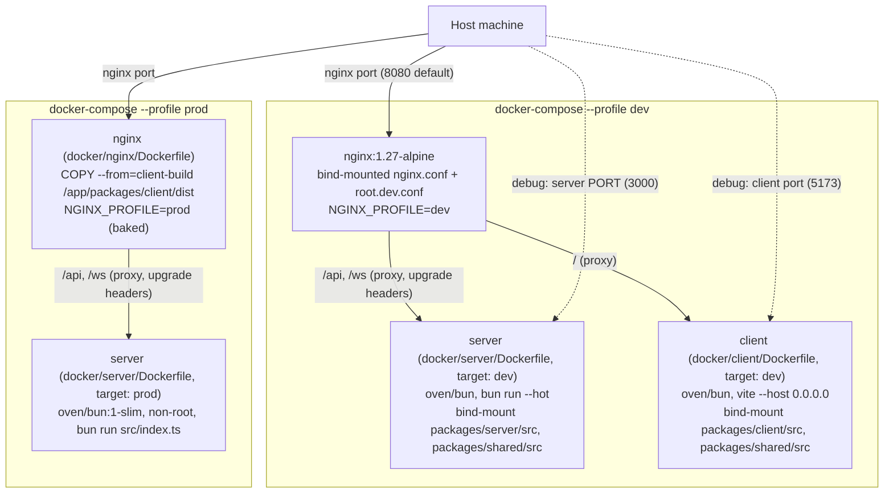

# FEAT-002 — Docker Compose Integration — Design

**Status:** Approved
**Source requirements:** [`requirements.md`](./requirements.md)

## 1. Problem Statement

Containerize the existing `@codayon` monorepo (server, client) with Docker
Compose for local runtime orchestration and sandboxing. Provide a **dev**
profile (bind-mounted source, live reload) and a **prod** profile (fully
baked, multi-stage images, static client build) with nginx as a same-origin
reverse proxy in front of both, including working WebSocket-upgrade proxying
for the application's real-time relay. Dockerfiles must be standalone-runnable
so they remain portable to Railway (or similar) later, without producing any
Railway-specific config in this slice. No persistence services.

## 2. Requirements Coverage

| Group | Requirements |
|-------|--------------|
| Standalone containers | REQ-001, REQ-002 |
| Dev profile orchestration | REQ-003, REQ-004 |
| Same-origin routing via nginx | REQ-005, REQ-006 |
| Production profile | REQ-007, REQ-008, REQ-009 |
| Configuration | REQ-010 |
| Non-functional | NFR-001..004 |

## 3. Approved Technology Decisions

- **Base image:** official `oven/bun` image for build/dev stages;
  `oven/bun:1-slim` for the production server runtime stage. Matches Bun as
  the project's committed runtime/package manager and is the documented
  best-practice pairing for Bun multi-stage Docker builds.
- **Reverse proxy:** nginx (`nginx:1.27-alpine` for the dev profile's
  bind-mount-config service; a dedicated multi-stage `docker/nginx/Dockerfile`
  for prod). Chosen for same-origin routing only — **not** for TLS
  termination, which is out of scope here and, on platforms like Railway, is
  handled at the platform edge regardless.
- **Compose profiles:** Docker Compose's native `profiles:` mechanism
  (`dev`, `prod`) rather than separate Compose files, so both share one
  `docker-compose.yml` and one network definition.
- **Dependency strategy:** `bun install --frozen-lockfile` at image build
  time for every target (dev and prod). `node_modules` is never bind-mounted,
  avoiding host/container architecture mismatches; only `src` directories are
  bind-mounted in dev.
- **nginx config strategy:** one shared `nginx.conf` containing the routes
  common to both profiles (`/api`, `/ws`, `/health`), plus an `include` of a
  small `location /` fragment (`root.dev.conf` or `root.prod.conf`) selected
  by an entrypoint script based on an `NGINX_PROFILE` env var — avoiding two
  independently maintained full nginx configs while also avoiding fragile
  `if`-based branching inside a single nginx config (nginx's `if` directive is
  documented as unreliable when combined with `proxy_pass`/`try_files` in the
  same block).
- **Client build-time API URL:** `ARG VITE_API_URL=""` / `ENV VITE_API_URL`
  plumbed through the client's build stage for forward compatibility. No
  current client code reads `import.meta.env.VITE_API_URL` (verified — the
  client relies entirely on relative `/api`, `/ws` paths plus Vite's dev
  proxy), so this is inert scaffolding today, not a behavior change.
- **Railway compatibility:** informed by Railway's documented compose-mapping
  model — Railway does not execute `docker-compose.yml` directly; it maps
  each Compose service to an individually deployed Railway service. This
  means every Dockerfile here must build and run standalone, with no
  assumption baked in that another Compose service is present (e.g., no
  `depends_on`-based startup-order assumption inside a Dockerfile/CMD itself;
  `depends_on` in Compose only affects local orchestration ordering).

## 4. Architecture



### Directory layout

```
docker/
  server/Dockerfile        # multi-stage: base -> dev, and base -> prod (oven/bun:1-slim, non-root)
  client/Dockerfile        # multi-stage: base -> dev, and base -> build -> prod (static dist/ only, FROM scratch)
  nginx/
    Dockerfile              # prod-only: COPY --from=client build stage's dist/ into nginx image
    nginx.conf              # shared: /api, /ws (WS upgrade headers), /health, includes root.active.conf
    root.dev.conf           # location / -> proxy_pass to client:5173
    root.prod.conf          # location / -> try_files static + index.html fallback
    entrypoint.sh           # selects root.dev.conf or root.prod.conf based on NGINX_PROFILE
docker-compose.yml          # dev + prod profiles, shared network
.env.example
```

### Build context

Both `docker/server/Dockerfile` and `docker/client/Dockerfile` are built with
the **monorepo root** as context (`docker build -f docker/server/Dockerfile .`
from the repo root), because Bun workspaces require the root `package.json` +
`bun.lock` plus the sibling `packages/shared` package to resolve
`workspace:*` dependencies. This is unavoidable regardless of where the
Dockerfile itself lives, so Dockerfiles are centralized under `docker/` rather
than colocated inside `packages/server` / `packages/client`, keeping package
directories focused on application code only and keeping all
container/orchestration concerns (server, client, nginx Dockerfiles) discoverable
in one place.

## 5. nginx Routing Model

One shared `nginx.conf` server block handles:

- `location /ws` — proxies to `http://server:3000` with
  `proxy_http_version 1.1`, `proxy_set_header Upgrade $http_upgrade`, and
  `proxy_set_header Connection $connection_upgrade` (via a `map` on
  `$http_upgrade`). Required for the app's `@codemirror/collab`-based relay
  (`packages/server/src/ws.ts`) to complete its upgrade handshake — **not**
  y-websocket/Yjs, which this project does not use.
- `location /api` and `location /health` — proxy to `http://server:3000`,
  plain HTTP.
- `include /etc/nginx/conf.d/root.active.conf` — the only profile-dependent
  piece, populated at container start by `entrypoint.sh` copying either
  `root.dev.conf` (proxies everything else to `http://client:5173`) or
  `root.prod.conf` (`try_files $uri $uri/ /index.html` against the static
  files baked into the image).

Vite's own HMR WebSocket path is intentionally **not** given special upgrade
handling — only the app's `/ws` endpoint is proxied with upgrade support, per
REQ-006.2. A manual browser refresh is expected after client edits in dev.

## 6. Server-Side Invariants

- **Dockerfile standalone runnability** (NFR-001): every image must build and
  serve traffic correctly when run with `docker run` alone, with no
  environment-specific assumption that only holds true inside this project's
  Compose network (service DNS names like `server`/`client` are used only by
  nginx's config and the client's dev proxy target, not inside the
  server/client images themselves).
- **No dependency volume-mounting** (REQ-004.2): `node_modules` always comes
  from the image; only `src` is bind-mounted, preventing native-module
  architecture mismatches between host and container.
- **No behavior change to FEAT-001** (NFR-002): this feature touches
  `packages/client/vite.config.ts` only to make the dev-proxy target
  configurable via `VITE_PROXY_TARGET` (defaulting to the existing
  `http://localhost:3000` when unset, so non-Docker `bun run dev` behavior is
  unchanged) and does not modify server/client application logic.

## 7. Task Breakdown

Each task is a working, demoable increment, verified against a running
container/stack, ending by wiring into the previous task's output. No
orphaned code.

1. **Server Dockerfile (dev-oriented, standalone).** `docker/server/Dockerfile`
   `dev` target: `oven/bun`, `bun install --frozen-lockfile`,
   `bun run --hot src/index.ts`. Demo: `docker run -p 3000:3000` responds on
   `GET /health` and `POST /api/rooms`. (REQ-001)
2. **Client Dockerfile (dev-oriented, standalone).** `docker/client/Dockerfile`
   `dev` target: `oven/bun`, `bun install --frozen-lockfile`,
   `vite --host 0.0.0.0`. Demo: `docker run -p 5173:5173` serves the SPA
   shell. (REQ-002)
3. **docker-compose dev profile wiring server + client (no nginx yet).**
   `docker-compose.yml` `dev` profile; bind-mount `src` dirs; client's Vite
   proxy target pointed at the server's Compose service name. Demo: live-edit
   a server/client file on host, see it take effect without rebuild.
   (REQ-003, REQ-004)
4. **Introduce nginx for dev profile (same-origin routing).**
   `docker/nginx/nginx.conf` + `root.dev.conf` + `entrypoint.sh`; nginx service
   added to the dev profile. Demo: single nginx URL serves the client, calls
   the API, and completes a `/ws` upgrade handshake (verified via WS status
   101 in nginx's access log). (REQ-005, REQ-006)
5. **`.env.example` and environment variable wiring.** Extract ports into
   Compose-level env vars with defaults; add `.env.example`. Demo: changing a
   port in `.env` changes the running stack's exposed port. (REQ-010)
6. **Server Dockerfile — production multi-stage build.** Add a `prod` target:
   `oven/bun` build stage -> `oven/bun:1-slim` runtime, non-root user,
   `--production` install. Demo: `docker build --target prod` yields a
   smaller image serving the same API. (REQ-007, NFR-003)
7. **Client Dockerfile — production build + static output.** Add a `build`
   stage running `vite build` with `ARG VITE_API_URL` passthrough, and a
   `prod` stage (`FROM scratch`) exposing only `dist/`. Demo: build produces
   valid static assets; build-arg accepted without behavior change.
   (REQ-008.1, REQ-008.3)
8. **docker-compose prod profile wiring — dedicated nginx image + prod
   stack.** `docker/nginx/Dockerfile` multi-stage `COPY --from=` the client's
   build stage; `prod` Compose profile wiring the prod server + this nginx
   image, no bind mounts. Demo: `docker compose --profile prod up` serves the
   full app (including a working `/ws` upgrade) through nginx alone; `docker
   compose ps` shows no client container and no bind mounts. (REQ-008.2,
   REQ-009)
